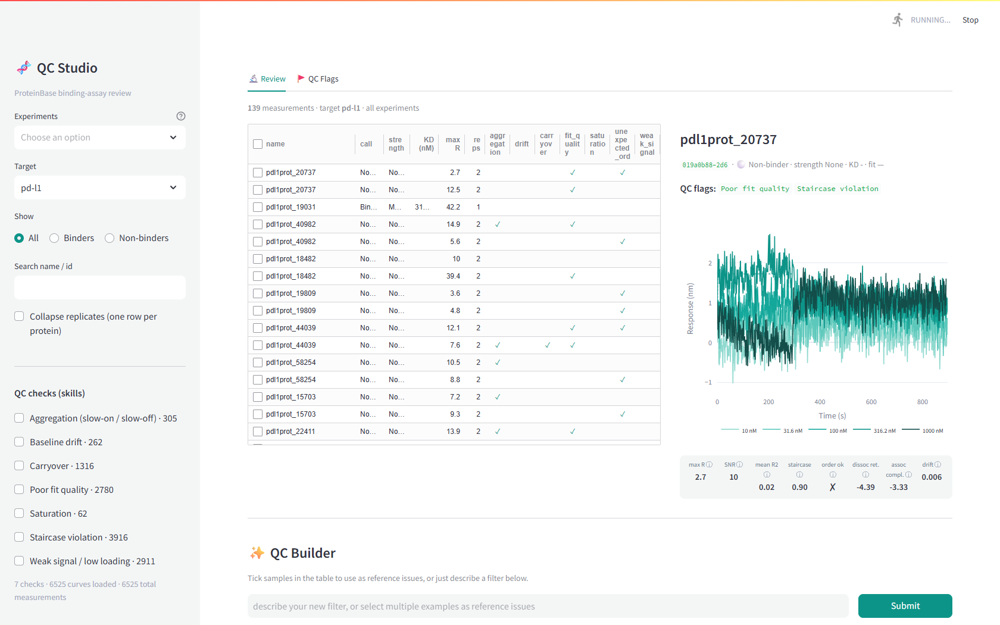

# ProteinBase QC Studio

A data-review and QC tool for binding-assay sensorgrams. A scientist browses
measurements across every ProteinBase experiment, scans many same-target curves
to spot patterns, and, the core of the build, turns a plain-language criterion
into a reusable QC check, while a persistent AI builder watches the curve they're
looking at.

Built against live [ProteinBase](https://proteinbase.com) data: all **24 targets
/ 6,525 measurements / 21 experiments**.



---

## Try it

This repo ships with the full metadata + QC features precomputed
(`data/measurements.db`), and the sensorgram curves stream on demand from
ProteinBase's public CDN, so browsing, filtering and the QC-flag columns work out
of the box with no ingest step.

**Run locally**

```bash
python -m venv .venv && .venv\Scripts\activate      # Windows (use bin/activate on macOS/Linux)
pip install -r requirements.txt
streamlit run app.py                                # opens http://localhost:8501
```

**Deploy your own live demo** (free, ~1 min): push this repo to your GitHub, go to
[share.streamlit.io](https://share.streamlit.io) → *New app* → pick the repo and
`app.py`.

The **QC Builder** (the natural-language / example-driven check author) calls
Claude. It is disabled unless an `ANTHROPIC_API_KEY` is available, so the public
demo stays read-only by default. To enable it, set the key in the environment, a
local `.env`, or Streamlit Cloud *Secrets*:

```toml
# .streamlit/secrets.toml   (never commit this)
ANTHROPIC_API_KEY = "sk-ant-..."
```

**Rebuild the dataset from scratch** (optional — refreshes from ProteinBase):

```bash
python build_experiments.py   # map experiments (collections) -> proteins
python ingest.py              # all measurements (auto-downloads the ProteinBase CSV)
python precompute_all.py      # compute + cache QC features for every curve
```

---

## How the AI sees and understands the curves

This is deliberate and transparent (the **"How Claude sees this curve"** expander
in the app shows it live). For every curve the scientist tags or is viewing,
Claude receives **two things**:

1. **The rendered sensorgram as an image** (PNG): time on x, response on y, one
   line per analyte concentration, dotted line = the 1:1 kinetic fit. This is the
   *same* picture the scientist sees. It lets the model recognise the *shape* of a
   pattern (a broken staircase, a non-returning dissociation, a saturated top
   concentration) the way a human would.

2. **The underlying data as a numeric feature vector**: concentrations,
   per-concentration plateau responses, max response, SNR, fit R², the
   concentration-vs-response rank correlation, carryover fraction, baseline drift,
   etc. (`engine.curve_payload`). This is what the model reasons *precisely* over.

The model is instructed to use the **image to understand** the pattern and to
express the **check in terms of the numeric features**, because at run time the
saved check executes only on those features across the whole dataset (the image
is not available then). If a pattern is visible in the image but not separable by
the listed features, it says so and falls back to a sandboxed Python expression
over the feature dict. So the picture informs authoring; the data does the
flagging, reproducibly.

---

## What it does

**Sidebar — experiment → target.** Pick one or more **experiments** (ProteinBase
collections like *BoltzGen Release*, *Nipah Competition*, *EGFR Round 2*); the
**target** list updates to only the targets in those experiments. Then filter by
binder/non-binder, search, or collapse replicates.

**Review (main).**
- A sortable measurements table (sort numerically by KD, max response, flag
  count; click any row to load it).
- A large sensorgram viewer with the 1:1 fit, the binder call / strength / KD, the
  live QC flags, and a **single row of QC feature values** beneath it.
- A **same-target gallery** (6×4) of sensorgrams for that target pulled from *all*
  experiments, each clickable to load into the viewer, for fast pattern-scanning.

**QC Builder (persistent right rail).** Always visible so you can write
criteria while looking at curves. Describe a criterion and/or tag examples; Claude
authors a concrete check (see above), you preview what it flags, and save it as a
skill. Saved checks become filters in the sidebar and rows in QC Flags.

**QC Flags.** Every saved check run across the loaded curves, with the offending
curves shown.


---

## How the check engine works

- **Fixed feature vocabulary.** Every curve is reduced to ~15 features that match
  Adaptyv's QC language: `spearman_conc_response` / `order_respected` (staircase /
  unexpected order), `carryover_frac`, `weak_signal` / `snr`, `max_baseline_drift`,
  `saturation_top_step_frac`, `mean_r2` (fit quality). See `features.py`.
- **Checks are specs, not opaque calls.** The default check is a small validated
  JSON predicate over those features (`{"any":[{"feature":"order_respected",
  "op":"==","value":false}, ...]}`), with one automatic repair round if the model
  strays from the grammar. A `code` mode (sandboxed Python over the feature dict)
  is the escape hatch for shape-based criteria. Saved checks are auditable YAML
  "skills" in `checks/`.

```
build_experiments.py  collections -> experiments.json (experiment membership)
ingest.py             ProteinBase CSV -> SQLite of all measurements (metadata)
dataio.py             lazy curve download + cached QC features (covers all 6,525)
features.py           one curve -> QC feature vector
viz.py                interactive plotly + matplotlib PNG (the image sent to Claude)
engine.py             NL + image + data -> Claude -> validated check -> run
app.py                Streamlit UI (sidebar / review / gallery / builder rail)
```

---

## What I found in the data

- `order_respected` (a clean staircase) separates binders from non-binders well on
  its own: most binders respect concentration order, most non-binders don't.
- The released data is clean, as warned, so checks fire on a believable minority.
- ProteinBase stores curves in two fit shapes (`fit` vs `fits` with
  `standard`/`bivalent`); handling only one silently breaks the phase split.
- "Experiment" isn't in the bulk CSV; it had to be reconstructed from the
  collection pages' scoped download API.

## Where it fails / what's next

- **Per-view feature cap.** To stay responsive over 6,525 curves, QC features are
  computed lazily and capped at 250 per view (cached after). Huge targets (nipah
  ~3,000, egfr ~2,000) show a 250-curve working set; narrow by experiment to focus.
  Full eager precompute would lift the cap.
- **Loading signal is proxied** from overall response, not a measured ligand-load
  step.
- **Replicate stats are naive**: replicates share the protein's median KD/label.
- **R² is raw-vs-model agreement** computed here, not Adaptyv's foundry metric.
- **Example-driven inference is shallow**: tagged curves' images + features go to
  the model, but it doesn't yet fit a threshold to maximise separation, nor train
  the "small classifier from 20 examples" Julian mentioned. The skill format is the
  right place to hang both.
- **`code`-mode sandbox** restricts builtins but isn't a true sandbox; fine for a
  single-user review tool.
